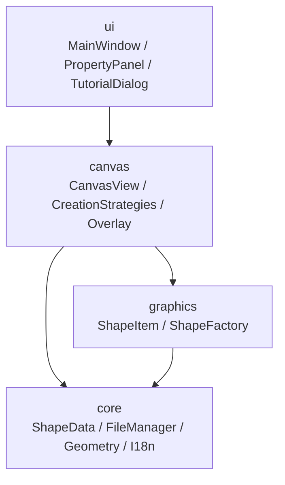

# 四层架构

  

  

  

    

      
单向依赖

      
下层不引用上层，`core` 层完全不依赖 Qt Widgets，可被图形、I/O、测试共同复用。

    

    

      
职责分离

      
视图分发输入，图形层负责绘制，核心层负责数据和几何，不把业务逻辑堆在主窗口。

    

    

      
测试友好

      
`vector_graphics_editor_core` 作为静态库可以单独链接测试，几何与文件格式都能脱离 GUI 验证。

    

  

<!--
架构页要强调：这不是“为了分层而分层”，而是为了让 ShapeData、FileManager、CanvasGeometry 这些核心逻辑能脱离界面独立验证。如果把它们都塞进 MainWindow，后面的测试和扩展都会变得很痛苦。
-->
