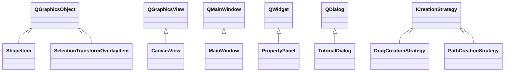

# 继承体系

::left::

::right::

  

    
Qt 继承链

    
界面类继承 Qt 提供的窗口 / 视图基类，重写事件函数和绘制接口，复用成熟框架能力。

  

  

    
为什么 `ShapeItem` 继承 `QGraphicsObject`

    
它同时具备 `QGraphicsItem` 的绘制 / 命中测试能力和 `QObject` 的元对象支持，比直接继承 `QGraphicsItem` 更完整。

  

  

    
课程知识点落地

    
全部采用 `public` 继承表达 “is-a” 关系；创建策略接口则把继承和多态真正用到了业务流程上。

  

<!--
这页适合回答“你的项目里有哪些继承关系”。同时顺手讲一个高频追问：为什么不用 QGraphicsItem。答案是我需要的不只是绘制，还要保留 QObject 那套能力，所以选择了 QGraphicsObject。
-->
