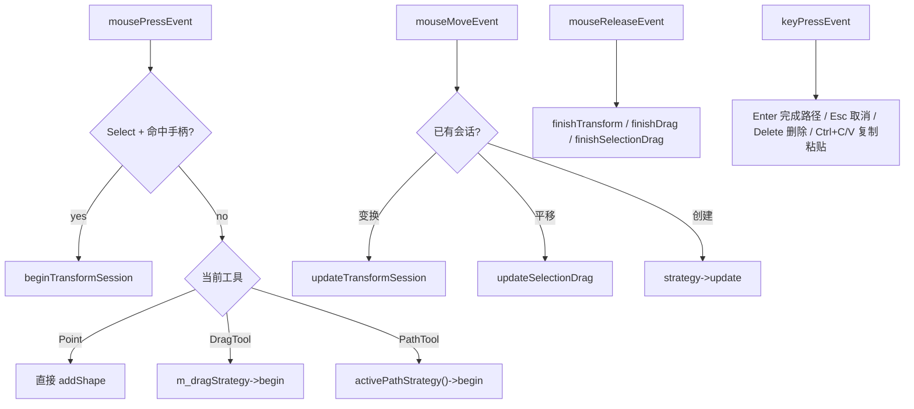

# 事件分发流程

  

  

  

    

      
先分发，再计算

      
`CanvasViewInput.cpp` 的职责是识别当前模式并路由事件，几何计算被下放给策略和 `CanvasGeometry`。

    

    

      
交互优先级明确

      
选择模式下，命中手柄优先于普通选中，避免用户拖缩放柄时误触发 item selection。

    

  

<!--
这一页讲“输入状态机”。最重要的点是：不同会话互斥，事件只会流向一个明确入口。比如变换会话开始后，mouseMove 不再进入普通拖拽创建逻辑，这样状态才稳定。
-->
